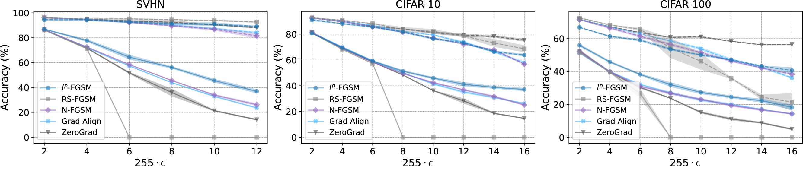

# $l^p$-FGSM: An $l^p$ Norm Solution to Catastrophic Overfitting in Fast Adversarial Training

## Abstract
Adversarial training enhances the robustness of deep neural networks but often at the cost of increased computational requirements. Fast adversarial training methods like the Fast Gradient Sign Method (FGSM) offer efficiency but are prone to "catastrophic overfitting," resulting in models that withstand single-step attacks yet falter against multi-step variants. Our work, pivoting on the observation that catastrophic overfitting is more prevalent under the $l^\infty$ norm compared to the $l^2$ norm, introduces an $l^p$-norm-based adversarial training framework. This framework effectively addresses $l^\infty$ adversarial robustness and mitigates catastrophic overfitting.

## Introduction
This repository hosts the TensorFlow implementation of our $l^p$-norm-based adversarial training method. By bridging the gap between $l^2$ and $l^\infty$ attacks, we present $l^p$-FGSM for generating efficient single-step $l^p$ adversarial perturbations.

## Installation
Install dependencies via:

```bash
pip install -r requirements.txt
```

## Usage
A self-contained notebook .ipynb is provided to test $l^p$-FGSM interactively.
The different Python files could be used as follows:
1. **Training a Model**: Execute `train_model.py` with desired parameters. For example:
   ```bash
   python train_model.py --dataset_name CIFAR10 --epochs 30 --eps 8.0 --p 32.0 --add_noise --weight_decay 5e-4
   ```
2. **Evaluating Robustness**: Use `pgd_attack.py` to assess your model's resilience to PGD attacks.
3. **Custom Training**: Adapt `train_model.py` for tailored adversarial training procedures.

## Review Addendum

#### Enhanced Illustration of Catastrophic Overfitting (CO):

We have improved the depiction of Catastrophic Overfitting (CO) in **Figure 5**. An additional 3D figure has been added to the appendix, introducing an epoch axis to demonstrate the accuracy decrease and the occurrence of CO. This new visualization allows the role of the norm $p$ selection to be observed, highlighting where accuracy declines sharply during training while simultaneously increasing robustness to FGSM.

<p align="center">
  
</p>

**Figure 11** presents the Evolution of single-step (FGSM) and multi-step (PGD-50) adversarial robustness for the CIFAR-10 dataset. Here, we consider an epsilon value of `8/255` and the WRN-28-8 architecture. The analysis varies across different values of $p$, showcasing the $l^p$ norm's potential in mitigating Catastrophic Overfitting (CO). The onset of CO is marked by a precipitous decline in multi-step adversarial robustness (PGD-50), while single-step robustness (FGSM) sees an upturn. Lower $p$ values mirror the $l^2$ norm's behavior with diminished resilience to $l^\{infty}$ attacks. Conversely, higher $p$ values are more susceptible to CO. Notably, $p$ values in the range of 16 to 32 exhibit resistance to both $l^\{infty}$ attacks and CO.


#### AutoAttack results:
To ensure a comprehensive assessment, we have also included robust accuracy results evaluated with [AutoAttack (AA)](https://github.com/fra31/auto-attack). 
We present the clean (top) and robust (bottom) accuracies for CIFAR-10 using WRN-28-8, evaluated with AA. The pattern observed is consistent with the results from PGD50, showing a common trend.

###### Table: CIFAR-10 (WRN-28-8) Clean and AutoAttack Accuracy Evaluation
| Method     | $\epsilon=2/255$  | $\epsilon=4/255$  | $\epsilon=8/255$  | $\epsilon=12/255$ | $\epsilon=16/255$ |
|------------|---------------|---------------|---------------|---------------|---------------|
| FGSM       | 0% $\pm$ 0    | 0% $\pm$ 0    | 0% $\pm$ 0    | 0% $\pm$ 0    | 0% $\pm$ 0    |
| RS-FGSM    | 0% $\pm$ 0    | 0% $\pm$ 0    | 0% $\pm$ 0    | 0% $\pm$ 0    | 0% $\pm$ 0    |
| N-FGSM     | 0% $\pm$ 0    | 0% $\pm$ 0    | 0% $\pm$ 0    | 0% $\pm$ 0    | 0% $\pm$ 0    |
| $l^p$-FGSM | 0% $\pm$ 0    | 0% $\pm$ 0    | 0% $\pm$ 0    | 0% $\pm$ 0    | 0% $\pm$ 0    |

The adversarial training models tested include our proposed method, the baseline FGSM, RS-FGSM, N-FGSM(k=2), and our method $ l^p$-FGSM. Across all epsilon levels, Catastrophic Overfitting (CO) is visible, where clean accuracy remains high while robust accuracy drops to zero.
The consistency of the patterns between PGD50 and AA supports the generality of our findings.


## Results
Our approach shows a marked improvement in addressing catastrophic overfitting. Below is a summary of our key findings:

<p align="center">
  
</p>

Detailed results for different datasets and $\epsilon$ values are as follows:


##### Table: Performance on SVHN Dataset as a Function of $\epsilon$

| $255\cdot\epsilon $ | $l^p$-FGSM | RS-FGSM | N-FGSM | Grad Al | ZeroG |
|---|---|---|---|---|---|
| 2 | 94.4 ±0.44<br>**86.85 ±0.26** | **96.16 ±0.13**<br>86.17 ±0.17 | 96.04 ±0.24<br>86.46 ±0.12 | 96.01 ±0.25<br>86.44 ±0.15 | 96.08 ±0.22<br>86.47 ±0.17 |
| 4 | 94.36 ±0.68<br>**77.77 ±0.82** | **95.07 ±0.08**<br>71.25 ±0.43 | 94.56 ±0.18<br>72.54 ±0.21 | 94.57 ±0.24<br>72.18 ±0.22 | 94.83 ±0.19<br>71.64 ±0.24 |
| 6 | 92.77 ±0.69<br>**64.42 ±1.7** | **95.16 ±0.48**<br>0.0 ±0.0 | 92.27 ±0.36<br>58.44 ±0.18 | 92.55 ±0.26<br>57.36 ±0.27 | 93.52 ±0.24<br>51.77 ±0.58 |
| 8 | 91.14 ±0.69<br>**56.12 ±0.72** | **94.48 ±0.18**<br>0.0 ±0.0 | 89.59 ±0.48<br>45.64 ±0.21 | 90.16 ±0.36<br>43.88 ±0.16 | 92.43 ±1.33<br>35.96 ±2.78 |
| 10 | 90.95 ±1.2<br>**45.58 ±1.24** | **93.82 ±0.28**<br>0.0 ±0.0 | 86.78 ±0.88<br>33.98 ±0.48 | 87.26 ±0.73<br>32.88 ±0.36 | 90.36 ±0.33<br>21.36 ±0.37 |
| 12 | 89.06 ±0.36<br>**36.88 ±1.40** | **92.72 ±0.56**<br>0.0 ±0.0 | 81.49 ±1.66<br>26.17 ±0.88 | 84.12 ±0.44<br>23.64 ±0.42 | 88.11 ±0.47<br>14.16 ±0.38 |


##### Table: Performance on CIFAR-10 Dataset as a Function of $\epsilon$

| $255\cdot\epsilon $ | $l^p$-FGSM | RS-FGSM | N-FGSM | Grad Al | ZeroG |
|---|---|---|---|---|---|
| 2 | 91.08 ±0.6<br>80.80 ±0.2 | **92.86 ±0.14**<br>**80.91 ±0.14** | 92.49 ±0.14<br>81.42 ±0.34 | 92.54 ±0.13<br>81.32 ±0.43 | 92.62 ±0.16<br>81.41 ±0.32 |
| 4 | 88.15 ±0.37<br>**69.53 ±0.8** | **90.74 ±0.23**<br>68.24 ±0.19 | 89.64 ±0.23<br>69.10 ±0.27 | 89.93 ±0.34<br>69.80 ±0.48 | 90.21 ±0.22<br>69.21 ±0.21 |
| 6 | 85.58 ±0.52<br>**59.18 ±0.52** | **88.25 ±0.22**<br>57.24 ±0.19 | 85.74 ±0.32<br>58.26 ±0.18 | 86.94 ±0.16<br>59.14 ±0.16 | 86.11 ±0.45<br>58.44 ±0.19 |
| 8 | 81.73 ±0.62<br>**51.33 ±0.63** | 83.61 ±1.77<br>0.0 ±0.0 | 81.64 ±0.35<br>49.51 ±0.27 | 82.16 ±0.21<br>50.12 ±0.17 | **84.16 ±0.21**<br>48.32 ±0.21 |
| 10 | 76.56 ±0.65<br>**45.96 ±0.71** | **82.17 ±1.48**<br>0.0 ±0.0 | 76.94 ±0.12<br>42.39 ±0.39 | 79.42 ±0.28<br>41.42 ±0.52 | 81.29 ±0.73<br>36.18 ±0.19 |
| 12 | 73.34 ±0.6<br>**41.18 ±1.46** | 78.64 ±0.74<br>0.0 ±0.0 | 72.18 ±0.17<br>36.82 ±0.27 | 73.72 ±0.82<br>35.16 ±0.77 | **79.33 ±0.92**<br>28.26 ±1.81 |
| 14 | 66.47 ±0.68<br>**38.72 ±0.84** | 73.27 ±2.84<br>0.0 ±0.0 | 67.86 ±0.46<br>31.68 ±0.68 | 66.41 ±0.52<br>30.85 ±0.34 | **78.18 ±0.66**<br>18.56 ±0.35 |
| 16 | 63.8 ±0.72<br>**37.14 ±1.04** | 68.68 ±2.43<br>0.0 ±0.0 | 56.75 ±0.44<br>25.11 ±0.43 | 57.88 ±0.74<br>26.24 ±0.43 | **75.43 ±0.89**<br>14.66 ±0.22 |


##### Table: Performance on CIFAR-100 Dataset as a Function of $\epsilon$

| $255\cdot\epsilon $ | $l^p$-FGSM | RS-FGSM | N-FGSM | Grad Al | ZeroG |
|---|---|---|---|---|---|
| 2 | 66.83 ±0.12<br>**55.96 ±0.68** | **72.62 ±0.24**<br>51.62 ±0.56 | 71.52 ±0.14<br>52.24 ±0.35 | 71.61 ±0.23<br>51.51 ±0.48 | 71.64 ±0.22<br>52.63 ±0.64 |
| 4 | 61.36 ±0.37<br>**45.83 ±0.48** | **68.27 ±0.21**<br>39.56 ±0.14 | 66.51 ±0.48<br>39.96 ±0.31 | 67.09 ±0.19<br>39.81 ±0.48 | 67.21 ±0.18<br>39.61 ±0.32 |
| 6 | 59.08 ±0.52<br>**38.21 ±0.50** | **65.62 ±0.66**<br>26.61 ±2.79 | 61.42 ±0.63<br>30.99 ±0.27 | 62.86 ±0.1<br>32.11 ±0.24 | 63.65 ±0.12<br>30.28 ±0.51 |
| 8 | 53.54 ±0.64<br>**32.03 ±1.26** | 54.28 ±5.92<br>0.0 ±0.0 | 56.42 ±0.65<br>26.71 ±0.68 | 58.55 ±0.41<br>26.97 ±0.61 | **60.78 ±0.24**<br>23.72 ±0.16 |
| 10 | 50.06 ±0.48<br>**27.28 ±0.87** | 46.18 ±4.88<br>0.0 ±0.0 | 51.51 ±0.61<br>23.11 ±0.49 | 53.85 ±0.73<br>22.64 ±0.61 | **61.11 ±0.39**<br>15.15 ±0.45 |
| 12 | 47.17 ±0.24<br>**24.51 ±0.63** | 35.86 ±0.27<br>0.0 ±0.0 | 46.42 ±0.56<br>19.32 ±0.51 | 46.94 ±0.86<br>19.94 ±0.65 | **58.36 ±0.15**<br>11.12 ±0.66 |
| 14 | 43.26 ±0.28<br>**22.27 ±1.02** | 24.42 ±1.38<br>0.0 ±0.0 | 42.14 ±0.36<br>16.62 ±0.44 | 42.63 ±0.5<br>16.96 ±0.14 | **56.24 ±0.16**<br>8.81 ±0.34 |
| 16 | 40.62 ±1.7<br>**18.23 ±1.53** | 21.47 ±5.21<br>0.0 ±0.0 | 38.37 ±0.48<br>14.29 ±0.38 | 36.17 ±0.45<br>14.23 ±0.26 | **56.42 ±0.29**<br>4.92 ±0.38 |


## Contributing
We encourage contributions. Please submit pull requests or open issues for enhancements or bug fixes.

## Related Repositories
This project builds upon insights from the following works:

- [Understanding and Improving Fast Adversarial Training](https://github.com/tml-epfl/understanding-fast-adv-training)
- [ZeroGrad : Mitigating and Explaining Catastrophic Overfitting in FGSM Adversarial Training](https://github.com/rohban-lab/catastrophic_overfitting)
- [Make Some Noise: Reliable and Efficient Single-Step Adversarial Training](https://github.com/pdejorge/N-FGSM)
- [Adversarial Training for Free!](https://github.com/mahyarnajibi/FreeAdversarialTraining)

## License
This project is licensed under the MIT License - see the [LICENSE](LICENSE) file for details.

## Citation
If you find our method or this codebase useful in your research, please consider citing:

```bibtex
@article{lpFGSM,
  title={An $l^p$ Norm Solution to Catastrophic Overfitting in Fast Adversarial Training},
  author={He who remains et al.},
  journal={TVA},
  year={2024}
}
```


